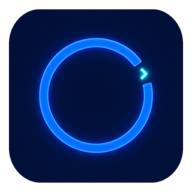
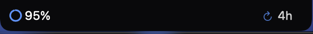
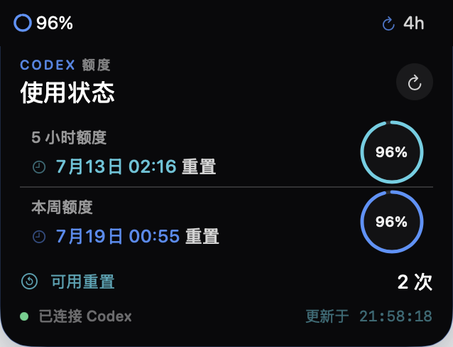

<div align="center">
  
  <h1>Codex Island</h1>
  <p>在 MacBook 刘海两侧，随时查看 Codex 剩余额度。</p>
</div>

Codex Island 是一个为带刘海 MacBook 设计的原生 macOS 小工具。Codex 运行时，它会在刘海两侧显示当前 5 小时额度的剩余百分比和重置倒计时；通过单击或悬停展开岛体后，可以查看 5 小时与本周额度、重置时间和可用重置次数。

## 功能

### 刘海常驻显示



最重要的 5 小时剩余额度固定显示在刘海左侧，重置倒计时显示在右侧。紧凑态保持贴合刘海的固定宽度，只在 Codex/ChatGPT 运行时出现。

### 点击或悬停展开详情



岛体向下展开后，通过高对比度圆环显示 5 小时额度和本周额度的剩余百分比，同时突出重置时间、可用重置次数、连接状态与最近更新时间。右键菜单可在“鼠标点击展开”和“鼠标悬停展开”之间切换，两种方式互斥生效。

### 功能列表

- 在刘海左侧显示 5 小时额度剩余百分比
- 在刘海右侧显示重置倒计时：一小时以上显示 `h`，不足一小时显示 `m`
- 可选择单击或悬停展开，两种交互方式互斥生效
- 展开后显示 5 小时额度、本周额度、重置时间和可用重置次数
- 高对比度额度圆环同时呈现剩余百分比与健康状态
- 剩余量低于 30% 显示橙色，低于 10% 显示红色
- Codex/ChatGPT 未运行时自动隐藏
- 右键支持切换展开方式、立即刷新、登录时启动和退出
- 只读调用本机 Codex `app-server`，不抓取界面
- 不复制、不展示、不上传 Codex 登录令牌
- 不包含分析、遥测或第三方网络请求

## 支持的 MacBook

Codex Island 只支持带实体刘海的 Apple Silicon MacBook 内建屏幕。

| 机型 | 支持情况 |
| --- | --- |
| 14 英寸 MacBook Pro（2021 年及以后、带刘海） | 支持 |
| 16 英寸 MacBook Pro（2021 年及以后、带刘海） | 支持 |
| 13 英寸 MacBook Air（M2 及以后、带刘海） | 支持 |
| 15 英寸 MacBook Air（M2 及以后、带刘海） | 支持 |
| 13 英寸无刘海 MacBook Pro | 不支持 |
| Intel MacBook、Mac mini、Mac Studio、iMac、Mac Pro | 不支持 |
| 外接显示器或合盖模式 | 暂不支持 |

最低系统要求：

- macOS 14 Sonoma 或更高版本
- Apple Silicon
- 已安装并登录 Codex 桌面应用；部分版本的应用名称可能显示为 ChatGPT

## 安装

1. 在 [Releases](https://github.com/bushiyaocheng/Codex-Quota-Island/releases) 下载最新的 `Codex-Island-v*.dmg`。
2. 打开 DMG，将 `Codex Island.app` 拖入 `Applications`。
3. 首次启动时右键应用并选择“打开”。
4. 保持 Codex/ChatGPT 正在运行，额度信息会自动出现在刘海两侧。

当前公开安装包使用 ad-hoc 签名，尚未经过 Apple Developer ID 公证。如果 macOS 阻止首次启动，可以在“系统设置 → 隐私与安全性”中选择“仍要打开”。

## 使用方式

- 单击或悬停刘海信息区域：按右键菜单中选择的方式展开详情
- 右键刘海信息区域：切换展开方式、刷新、切换登录时启动或退出
- Codex 退出：Codex Island 自动隐藏
- Codex 重新打开：Codex Island 自动恢复并刷新数据

## 数据来源与兼容性

应用仅在 Codex 正在运行时启动独立的只读 app-server 连接，并调用：

```text
account/rateLimits/read
```

读取字段包括：

- `primary.usedPercent`：5 小时窗口已用百分比
- `primary.resetsAt`：5 小时窗口重置时间
- `secondary.usedPercent`：每周窗口已用百分比
- `secondary.resetsAt`：每周窗口重置时间
- `rateLimitResetCredits.availableCount`：可用重置次数

剩余百分比由 `100 - usedPercent` 得出。app-server 属于 Codex 客户端协议，未来 Codex 更新可能改变方法或字段；协议访问已集中在 `AppServerClient.swift` 中，便于维护。

## 从源码构建

需要 Xcode 16 或更高版本。

```bash
git clone https://github.com/bushiyaocheng/Codex-Quota-Island.git
cd Codex-Quota-Island
chmod +x scripts/package_app.sh scripts/package_release.sh
./scripts/package_app.sh
open "dist/Codex Island.app"
```

生成 DMG：

```bash
./scripts/package_release.sh
```

开发模式：

```bash
swift run CodexIsland
```

直接使用 `swift run` 时，“登录时启动”不可用，因为该功能要求应用位于 `.app` 包内。

运行测试：

```bash
swift test
```

## 隐私

- 所有额度数据只在本机处理
- 不上传认证信息或额度数据
- 不执行额度重置；可用重置次数仅供展示
- 不包含第三方分析 SDK

## 已知限制

- 不支持无刘海屏幕的悬浮球或菜单栏回退
- 不支持外接屏幕显示
- Codex 客户端协议更新后可能需要同步适配
- 安装包尚未经过 Apple 公证

## 卸载

退出 Codex Island 后，从“应用程序”文件夹删除 `Codex Island.app`。如果启用了登录时启动，请先在右键菜单中关闭该选项。

## License

[MIT License](LICENSE)
