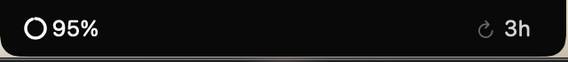
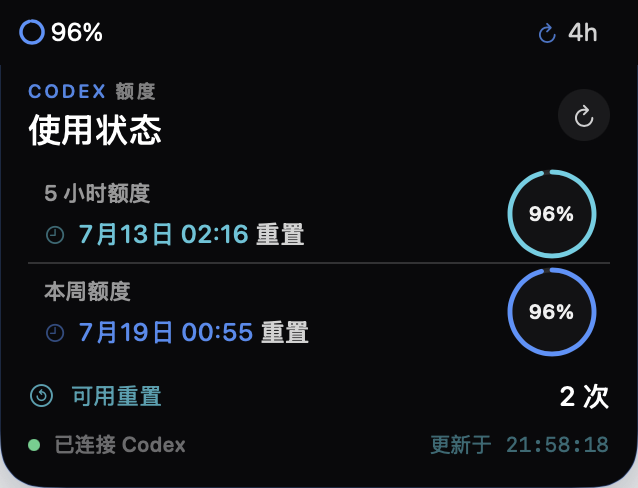
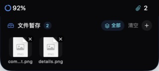

<div align="center">
  
  <h1>Codex Island</h1>
  <p>把 Codex 额度与临时文件托盘放进 MacBook 刘海。</p>
  <p>
    <strong>macOS 14+</strong> ·
    <strong>Apple Silicon</strong> ·
    <strong>带实体刘海的 MacBook</strong>
  </p>
  <p>
    <a href="https://github.com/bushiyaocheng/Codex-Quota-Island/releases/latest">下载最新安装包</a>
  </p>
</div>

Codex Island 是一个原生 macOS 小工具。它在刘海两侧显示 Codex 当前额度与重置倒计时，并提供一个只在需要时出现的文件暂存托盘，让图片和文档更容易拖入 Codex。

当前版本：**2.1.0（Build 6）**

## V2 有什么新功能

- 支持把 Finder、桌面、截图工具或其他应用中的文件拖入灵动岛
- 支持一次拖入多个文件
- 暂存区有文件时，灵动岛只展示文件信息并保持展开
- 支持逐个拖出，也支持拖动顶部的“全部”一次发送整批文件
- 成功拖出的文件会自动移出暂存区
- 最后一个文件移出后，灵动岛自动恢复额度状态
- 文件列表不会持久化，退出应用后自动清空
- 为 Codex 异步读取保留的临时副本最多存活 5 分钟，不会永久占用空间

## 界面

### 刘海常驻状态



最重要的短周期额度显示在刘海左侧，重置倒计时显示在右侧。Codex/ChatGPT 未运行时，灵动岛会自动隐藏。

### 额度详情



单击或悬停可展开详情。右键刘海区域可以在两种展开方式之间切换；它们互斥生效。

### 文件暂存



文件拖入灵动岛后，额度详情会让位给临时文件托盘：

- 图片显示缩略图，其他文件显示系统图标
- 点击 `+` 可以通过系统文件选择器批量添加
- 点击文件右上角 `×` 可以移除单个项目
- 点击“清空”可以清空当前暂存区
- 从缩略图拖到 Codex，可以发送单个文件
- 文件多于一个时，拖动“全部”可以一次发送整批文件

日常状态不会显示“拖入文件”提示；只有正在把文件拖向灵动岛时，才会出现接收提示。

## 安装

1. 前往 [GitHub Releases](https://github.com/bushiyaocheng/Codex-Quota-Island/releases)。
2. 下载最新的 `Codex-Island-v*.dmg`。
3. 打开 DMG，将 `Codex Island.app` 拖入 `Applications`。
4. 首次启动时，右键应用并选择“打开”。
5. 保持 Codex/ChatGPT 桌面应用正在运行。

当前公开安装包使用 **ad-hoc 签名**，尚未使用 Apple Developer ID 公证。如果 macOS 阻止首次启动，请在“系统设置 → 隐私与安全性”中选择“仍要打开”。

## 使用方式

| 操作 | 结果 |
| --- | --- |
| 单击或悬停刘海区域 | 按当前偏好展开额度详情 |
| 右键刘海区域 | 切换展开方式、刷新、管理登录启动或退出 |
| 把文件拖到刘海区域 | 展开文件托盘并加入暂存 |
| 从文件缩略图拖到 Codex | 发送单个文件，成功后移出暂存 |
| 拖动“全部”到 Codex | 一次发送当前全部暂存文件 |
| 点击 `+` | 使用系统文件选择器批量添加 |
| 点击 `×` 或“清空” | 移除暂存记录 |

## 文件生命周期

Codex Island 不会建立永久文件仓库：

- 原始文件不会被复制、移动或删除
- 暂存清单只存在于当前运行会话
- 其他应用只提供图片数据而没有原始文件 URL 时，应用会在系统临时目录创建副本
- 成功拖出后，临时副本最多保留 5 分钟，确保 Codex 有时间完成异步读取
- 清空暂存、退出应用或下次启动时都会清理相关临时副本

## 额度信息

应用仅在 Codex 正在运行时启动独立的只读 app-server 连接，并调用：

```text
account/rateLimits/read
```

主要读取：

- `primary` / `secondary`：服务端当前提供的额度窗口
- `windowDurationMins`：额度窗口持续时间
- `usedPercent`：已用百分比
- `resetsAt`：重置时间
- `rateLimitResetCredits.availableCount`：可用重置次数

窗口按持续时间排序；紧凑状态显示最短窗口，展开状态按服务端实际返回数量自动调整。剩余百分比由 `100 - usedPercent` 得出。

## 支持的设备

Codex Island 只支持带实体刘海的 Apple Silicon MacBook 内建屏幕。

| 设备 | 支持情况 |
| --- | --- |
| 14 英寸 MacBook Pro（2021 年及以后） | 支持 |
| 16 英寸 MacBook Pro（2021 年及以后） | 支持 |
| 13 英寸 MacBook Air（M2 及以后） | 支持 |
| 15 英寸 MacBook Air（M2 及以后） | 支持 |
| 13 英寸无刘海 MacBook Pro | 不支持 |
| Intel Mac、Mac mini、Mac Studio、iMac、Mac Pro | 不支持 |
| 外接显示器或合盖模式 | 暂不支持 |

系统要求：

- macOS 14 Sonoma 或更高版本
- Apple Silicon
- 已安装并登录 Codex 桌面应用；部分版本的应用名称可能显示为 ChatGPT

## 隐私

- 所有额度与文件处理都在本机完成
- Codex Island 不会主动上传暂存文件
- 不复制、不展示、不上传 Codex 登录令牌
- 不执行额度重置
- 不包含第三方分析 SDK、遥测或额外网络请求

## 从源码构建

需要 Xcode 16 或更高版本。

```bash
git clone https://github.com/bushiyaocheng/Codex-Quota-Island.git
cd Codex-Quota-Island
chmod +x script/build_and_run.sh scripts/package_app.sh scripts/package_release.sh
./script/build_and_run.sh --verify
```

运行测试：

```bash
swift test
```

生成 Release 应用：

```bash
CONFIGURATION=release ./scripts/package_app.sh
```

生成 DMG 与 SHA-256 校验文件：

```bash
./scripts/package_release.sh
```

输出文件位于 `dist/`：

```text
Codex Island.app
Codex-Island-v2.1.0.dmg
Codex-Island-v2.1.0.dmg.sha256
```

## 已知限制

- 不支持无刘海屏幕的悬浮球或菜单栏回退
- 不支持外接屏幕显示
- Codex app-server 协议更新后可能需要同步适配
- 安装包尚未经过 Apple Developer ID 签名与公证

## 卸载

退出 Codex Island 后，从“应用程序”文件夹删除 `Codex Island.app`。如果启用了登录时启动，请先在右键菜单中关闭该选项。

## License

[MIT License](LICENSE)
